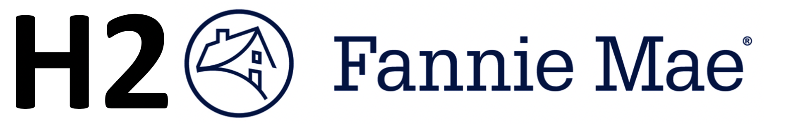

# Fanni Mae family loans

Need some more data than the famous 'German credit' data set (1000 records)? Then try the Single Family mortgages. For the years 2010,2011,2012 there are 6.1 mln mortages. This repo contains the analysis and modeling of Fannie Mae Single family loans with [h2o python](https://docs.h2o.ai/h2o/latest-stable/h2o-py/docs/intro.html).

See for further details:
https://www.fanniemae.com/portal/funding-the-market/data/loan-performance-data.html

https://www.fanniemae.com/resources/file/fundmarket/pdf/webinar-101.pdf

The main notebook is h2o_modeling.ipynb if you do not use all the data, only a few years then this analysis can be done on a descent laptop, otherwise a larger machine is needed. You can spin up a 'h2o_super_machine' on GCP if needed :-)
